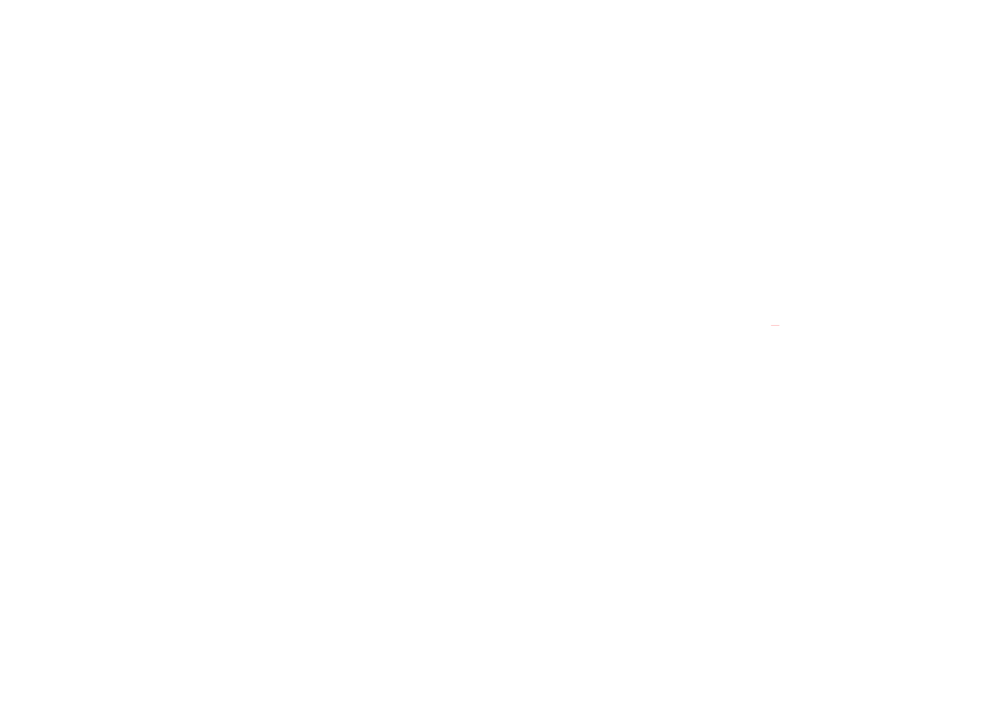
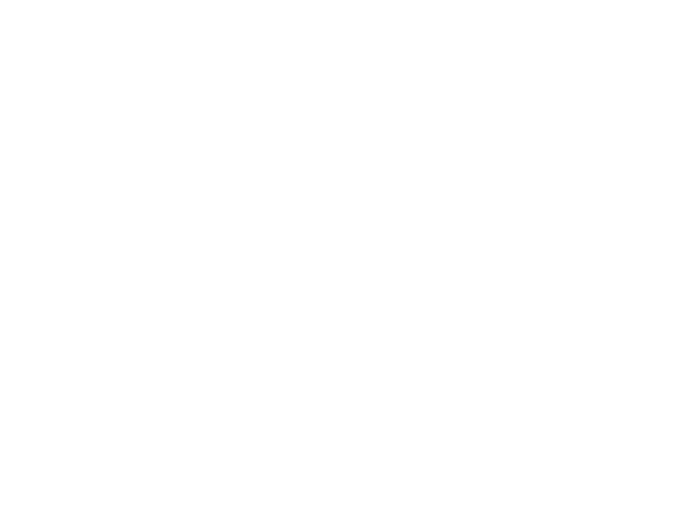
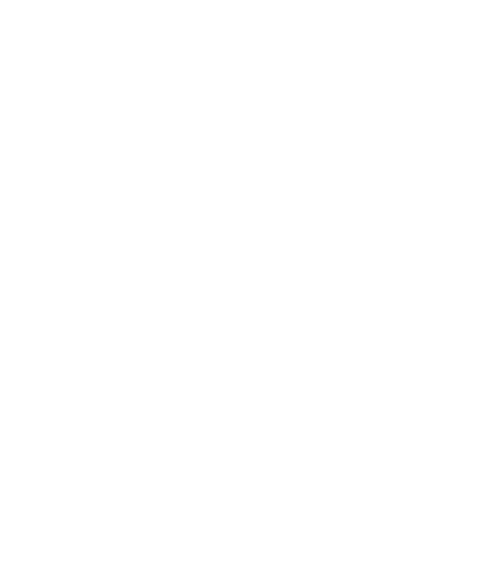
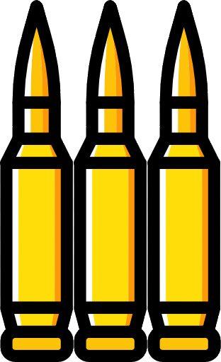
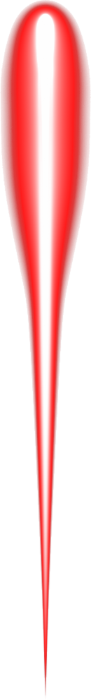

# Space Invaders

Space Invaders was a 1978 arcade game based on other shooting games of the time, as well as movies like _Star Wars_. This is my version of Space Invaders, written in Java. I have a spinoff version [on my website](https://techiecable.github.io/programs/space_invaders), but it deviates significantly from the original gameplay. For this version, I attempted to recreate the gameplay while also adding in nicer graphics and some different touches.

## Gameplay

A spaceship at the bottom, based on the x-wing from _Star Wars_ can travel from left to right. A group of aliens travels left to right as well, descending toward the player. The player and aliens shoot at each other. The player's goal is to stay alive as long as possible and prevent the aliens from reaching the bottom of the screen.

Powerups, such as ammo charges and hearts, travel from the left side of the screen. The player can shoot the ammo charges to reduce their reload time and the hearts to regain health (to a maximum of 10 hearts).

## Entities

| name | image |
|------|-------|
| aliens |   |
| player |  |
| ammo charges |  |
| hearts |  |
| blast bolts |  

## How to Play
- `space` to shoot
- `left arrow` or `right arrow` to go left or right
- `ESC` to restart
- shoot the aliens to destroy them
- shoot ammo charges to reduce reload time
- shoot the hearts to regain health
