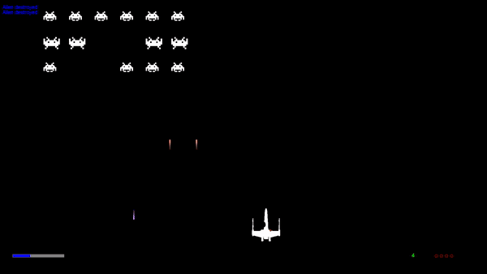
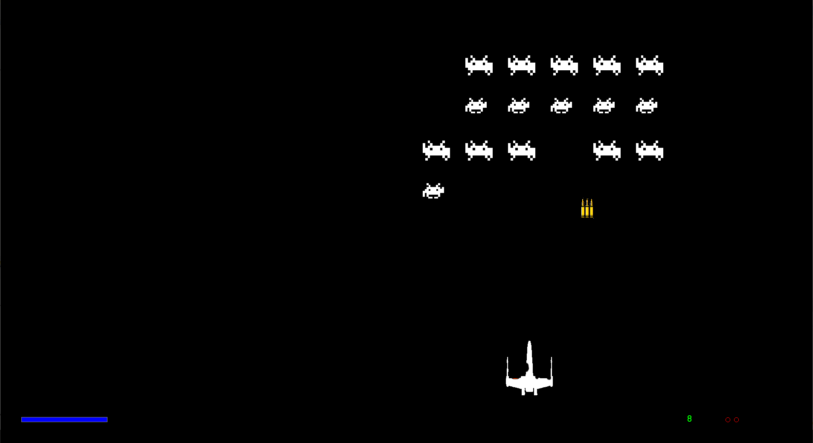

# Space Invaders

Space Invaders written in Java.

## Entities
- aliens
- player
- ammo charges
- hearts
- blast bolts

## How to Play
- `space` to shoot
- `left arrow` or `right arrow` to go left or right
- `ESC` to restart
- shoot the aliens to destroy them
- shoot ammo charges to reduce reload time
- shoot the hearts to regain health
